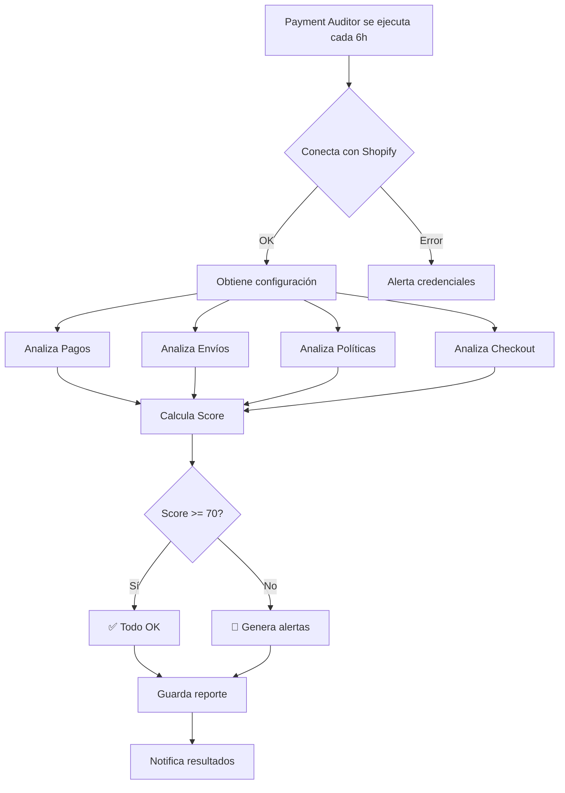

# 🤖 AGENTES ELITE - AUDITORIA AUTOMÁTICA SHOPIFY

## 🎯 NUEVO AGENTE: PAYMENT AUDITOR

Tu agente **Payment Auditor** ahora puede verificar AUTOMÁTICAMENTE:

✅ Métodos de pago activos (Mercado Pago, PayPal, etc)  
✅ Configuración de zonas de envío  
✅ Políticas legales completas  
✅ Settings de checkout  
✅ Estado general de cada tienda  
✅ Score de salud (0-100)  
✅ Recomendaciones priorizadas  

---

## 🚀 CÓMO EJECUTAR

### Opción 1: Desde tu PC (Windows)
```powershell
cd "c:\Goio mayordomo\palacio-central"
.\scripts\auditar-pagos.ps1
```

### Opción 2: Desde Google Cloud Shell
```bash
cd ~/Goio-Store/palacio-central
./scripts/auditar-pagos.sh
```

### Opción 3: Integrado con agentes ELITE (automático)
Ya está configurado para ejecutarse cada 6 horas junto con tus otros agentes.

---

## 📊 QUÉ VAS A VER

### Reporte ejemplo:

```json
{
  "timestamp": "2025-10-20T18:30:00.000Z",
  "tiendas": {
    "prod": {
      "store": "Goio Store PROD",
      "status": "AUDITADA",
      "score": 85,
      "pagos": {
        "estado": "✅ OPERATIVO",
        "tiene_mercadopago": true,
        "tiene_paypal": true
      },
      "envios": {
        "estado": "✅ OPERATIVO",
        "tiene_lima": true,
        "tiene_envio_gratis": true
      },
      "recomendaciones": [
        {
          "prioridad": "BAJA",
          "categoria": "LEGAL",
          "mensaje": "Considera agregar política de privacidad",
          "impacto": "Mayor confianza del cliente"
        }
      ]
    },
    "coleccion": {
      "store": "Goio Store Colección",
      "status": "AUDITADA",
      "score": 45,
      "pagos": {
        "estado": "🔴 CRÍTICO - SIN MÉTODOS DE PAGO",
        "tiene_mercadopago": false,
        "tiene_paypal": false
      },
      "recomendaciones": [
        {
          "prioridad": "CRÍTICA",
          "categoria": "PAGOS",
          "mensaje": "🔴 Activar Mercado Pago URGENTE",
          "accion": "Settings → Payments → Activate Mercado Pago",
          "impacto": "Sin esto, CERO ventas posibles"
        }
      ]
    },
    "global": {
      "store": "Goio Global",
      "status": "NO_CONFIGURADA",
      "error": "Credenciales faltantes"
    }
  },
  "resumen": {
    "total_tiendas": 3,
    "operativas": 1,
    "con_problemas": 1,
    "sin_configurar": 1
  },
  "score_promedio": 65,
  "estado_imperio": "✅ BUENO - Algunas mejoras necesarias",
  "recomendaciones_criticas": [
    {
      "prioridad": "CRÍTICA",
      "tienda": "Goio Store Colección",
      "mensaje": "🔴 Activar Mercado Pago URGENTE"
    }
  ]
}
```

---

## 🎯 SCORE DE SALUD (0-100)

El agente calcula un score siguiendo la filosofía Candiani:

### Distribución de puntos:

**PAGOS (40 puntos)** - Lo más importante según Candiani:
- Mercado Pago: 20 puntos
- PayPal: 10 puntos  
- Tarjeta crédito: 10 puntos

**ENVÍOS (30 puntos)**:
- Tiene zonas configuradas: 15 puntos
- Tiene Lima configurado: 10 puntos
- Tiene envío gratis: 5 puntos

**POLÍTICAS (20 puntos)**:
- 4 políticas completas: 20 puntos
- Proporcional si faltan algunas

**CHECKOUT (10 puntos)**:
- Moneda correcta (PEN o USD): 10 puntos

---

## 🏆 INTERPRETACIÓN DEL SCORE

```markdown
90-100: 🏆 EXCELENTE - Todo configurado óptimamente
70-89:  ✅ BUENO - Listo para vender, mejoras menores
50-69:  🟡 REGULAR - Funciona pero requiere atención
30-49:  🟠 MALO - Problemas que afectan ventas
0-29:   🔴 CRÍTICO - No puede vender, configurar urgente
```

---

## 🔧 CONFIGURACIÓN NECESARIA

### Variables de entorno en `.env`:

```bash
# TIENDA PROD (Principal - FB Ads)
SHOPIFY_DOMAIN_PROD=goio-store-gollos.myshopify.com
SHOPIFY_ADMIN_TOKEN_PROD=shpat_xxxxxxxxxxxxx

# TIENDA COLECCIÓN (Test Lab - Orgánico)
SHOPIFY_DOMAIN_COLECCION=goio-coleccion.myshopify.com
SHOPIFY_ADMIN_TOKEN_COLECCION=shpat_xxxxxxxxxxxxx

# TIENDA GLOBAL (Internacional)
SHOPIFY_DOMAIN_GLOBAL=goio-global.myshopify.com
SHOPIFY_ADMIN_TOKEN_GLOBAL=shpat_xxxxxxxxxxxxx
```

### Cómo obtener los tokens:

1. Ve a tu tienda Shopify
2. Settings → Apps and sales channels
3. Develop apps → Create an app
4. Nombre: "Payment Auditor ELITE"
5. Configure → Admin API → Select scopes:
   - `read_payment_gateways`
   - `read_shipping`
   - `read_shopify_payments`
   - `read_products`
6. Install app → Reveal token
7. Copia el token a tu `.env`

---

## 📅 FRECUENCIA DE EJECUCIÓN

### Automática (Recomendado):
- Cada 6 horas junto con agentes ELITE
- Reportes guardados en `reports/payment-audits/`
- Alertas si score baja de 50

### Manual:
- Ejecuta cuando hagas cambios en configuración
- Antes de lanzar campañas FB Ads
- Semanalmente para monitoreo

---

## 🚨 ALERTAS AUTOMÁTICAS

El agente te alertará si:

🔴 **CRÍTICO:**
- Sin métodos de pago activos
- Sin zonas de envío configuradas
- Score < 30

🟡 **ADVERTENCIA:**
- Solo 1 método de pago
- Políticas incompletas
- Score 30-50

✅ **OK:**
- Todo configurado
- Score > 70

---

## 💡 RECOMENDACIONES PRIORIZADAS

El agente genera recomendaciones en orden de importancia:

### 1. CRÍTICAS (hacer HOY):
```
🔴 Activar Mercado Pago
🔴 Configurar envíos Lima
```

### 2. ALTAS (hacer esta semana):
```
🟡 Activar PayPal
🟡 Completar políticas legales
```

### 3. MEDIAS (hacer este mes):
```
🟢 Optimizar checkout
🟢 Configurar envío gratis
```

### 4. SABIDURÍA CANDIANI:
```
💡 "El dinero de la empresa es de la empresa"
💡 "Compra lo que se aprecia, renta lo que se deprecia"
```

---

## 🎯 INTEGRACIÓN CON OTROS AGENTES

### MarketIntelligence.js
```javascript
// Usa datos de Payment Auditor para validar clientes
const auditReport = await getLatestAudit();
if (auditReport.pagos.tiene_mercadopago) {
  // Lanzar campañas para mercado peruano
}
```

### PricingGenius.js
```javascript
// Ajusta precios según métodos de pago disponibles
if (store.pagos.tiene_mercadopago) {
  // Puede cobrar en cuotas sin intereses
  precioOptimo *= 1.1; // +10% por facilidad pago
}
```

### ConversionOptimizer.js
```javascript
// Optimiza copy según configuración
if (store.envios.tiene_envio_gratis) {
  copy.urgencia = "🎁 ENVÍO GRATIS en tu pedido";
}
```

---

## 📊 REPORTES GUARDADOS

Los reportes se guardan automáticamente en:

```
reports/
  └── payment-audits/
      ├── audit-2025-10-20-18-30-00.json
      ├── audit-2025-10-21-00-30-00.json
      ├── audit-2025-10-21-06-30-00.json
      └── ...
```

Puedes comparar reportes para ver evolución:

```bash
# Ver último reporte
cat reports/payment-audits/audit-*.json | tail -1 | jq

# Comparar scores
grep "score_promedio" reports/payment-audits/*.json
```

---

## 🔄 FLUJO COMPLETO



---

## ✅ BENEFICIOS

1. **Detección temprana** de problemas de configuración
2. **Sin ventas perdidas** por pagos mal configurados
3. **Visibilidad total** de tus 3 tiendas
4. **Filosofía Candiani** integrada en recomendaciones
5. **Reportes históricos** para auditorías
6. **Alertas automáticas** sin revisar manualmente

---

## 🎓 FILOSOFÍA CANDIANI APLICADA

El agente incorpora principios de Mauricio Candiani:

1. **"Los negocios son carrera de caja contra tiempo"**
   → Alertas críticas en métodos de pago

2. **"Calibrar la organización para producir rentabilidad"**
   → Score mide salud real de la tienda

3. **"Preguntas básicas: ¿A quién debo pagar? ¿Quién me debe?"**
   → Verifica que puedas cobrar (pagos) y puedas entregar (envíos)

4. **"Buenos clientes pagan bien"**
   → Múltiples métodos de pago = buenos clientes

---

## 🚀 PRÓXIMOS PASOS

1. **HOY:** Ejecuta auditoría para ver estado actual
2. **HOY:** Corrige todos los 🔴 CRÍTICOS
3. **Esta semana:** Atiende 🟡 ADVERTENCIAS
4. **Este mes:** Mejora hasta score 90+

---

## 📞 SOPORTE

¿El agente encontró algo que no sabes cómo arreglar?

1. Revisa el reporte JSON completo
2. Busca la sección `recomendaciones`
3. Sigue la `accion` paso a paso
4. Si persiste, pregunta aquí con el error específico

---

**Creado:** 20 Oct 2025  
**Agente:** Payment Auditor ELITE  
**Filosofía:** Mauricio Candiani  
**Imperio:** Goio Store (3 tiendas)  

🔍 **AUDITORÍA AUTOMÁTICA ACTIVADA** 🔍
